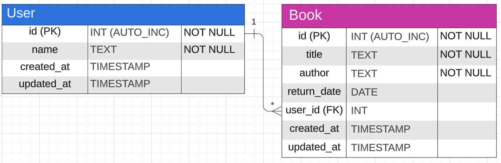

# Home Office Technical Test

## Introduction

This assessment is designed to evaluate your coding skills based on readability, maintainability, and testability. 
More than just arriving at the correct solution, we're interested in understanding your problem-solving approach.

## Pre-requisites before Interview

Complete the steps below **before** the interview. This will ensure that you can focus on coding rather than setting up the environment.

1. Set up a development environment on your local machine. You will need:
a. an IDE or code editor e.g. `VS Code`
b. `Laravel 10+` and `PHP 8.3` with `Composer` and `PHPUnit`
c. a web server such as `nginx` or `apache`
d. a `MySQL` database
e. `Postman` or `cURL`

See the [Laravel documentation](https://laravel.com/docs/10.x/installation) for details of how you can use [Laravel Herd](https://herd.laravel.com/) (MacOS) or [Homestead](https://laravel.com/docs/10.x/homestead) along with [DBngin](https://dbngin.com/) to get started quickly.  

2. Clone this project to your local machine.
3. Rename `.env.example` to `.env` and modify any connection / port / URL details in the file to match your setup.
4. Generate an app key using the command `php artisan key:generate`
5. Run `composer install` to install vendor packages.
6. Run `php artisan migrate:fresh —seed` to create the database tables and seed the database.
6. Run `php artisan test` and ensure the PHPUnit tests run successfully.
7. Manually test the `/users` endpoint using `Postman` or `cURL` to confirm functionality is working.
9. Take some time to familiarise yourself with the existing solution and consider how you'd incorporate new features and test your solution.

## Technologies

The application is written in PHP 8.3 using Laravel 10+. It is configured to use a MySQL database. It uses PHPUnit for testing.

## Database

The database is called `bookstore`. There are two tables called: `books` and `users`.

The entity relationship diagram is shown below:

The schema can be found in the `database - migrations` folder. 

The seed data can be found in the `database - seeders` folder.

This project is configured to use a MySQL database. If using `DBngin` to run MySQL, the default username is `root` with no password, as per the `.env.example` file. The default port is 3306.
